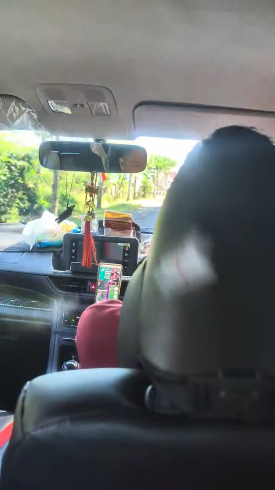
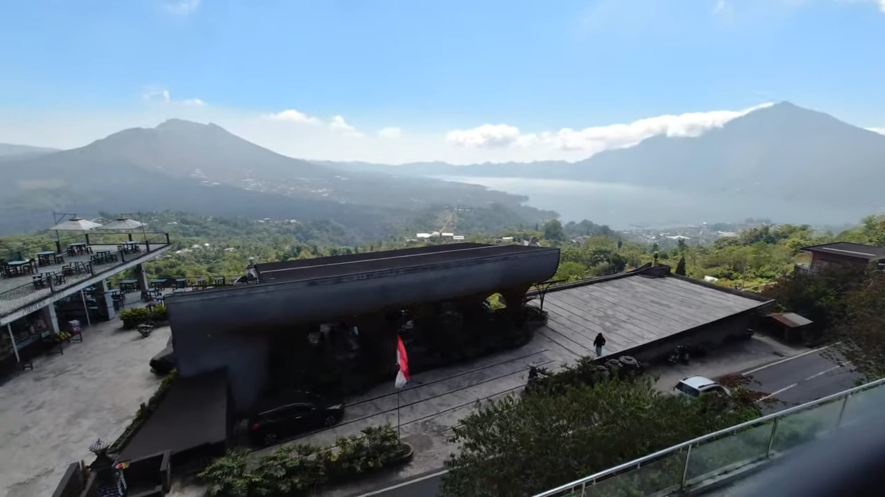
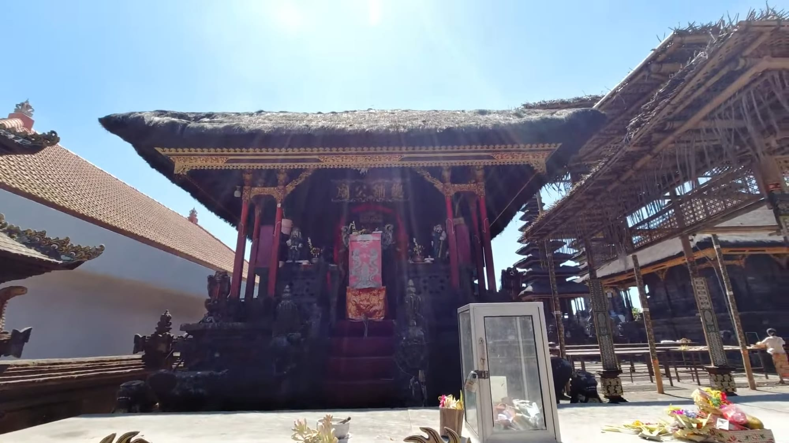
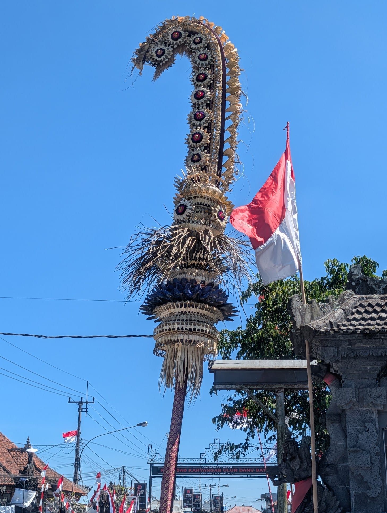
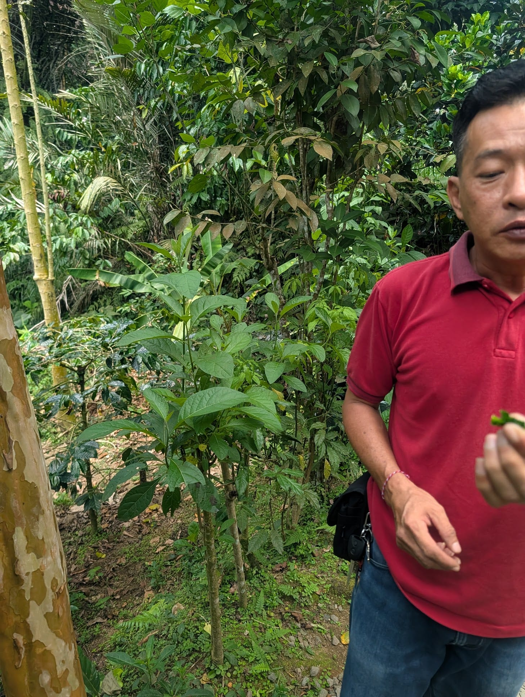
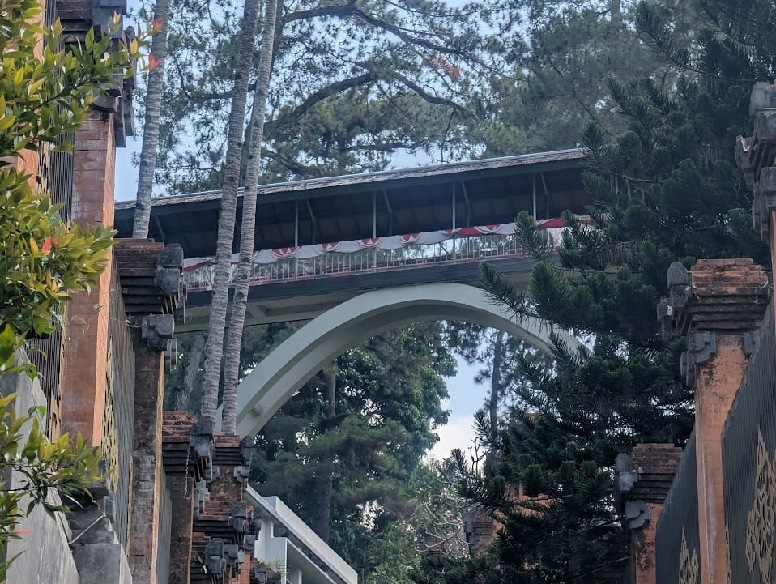
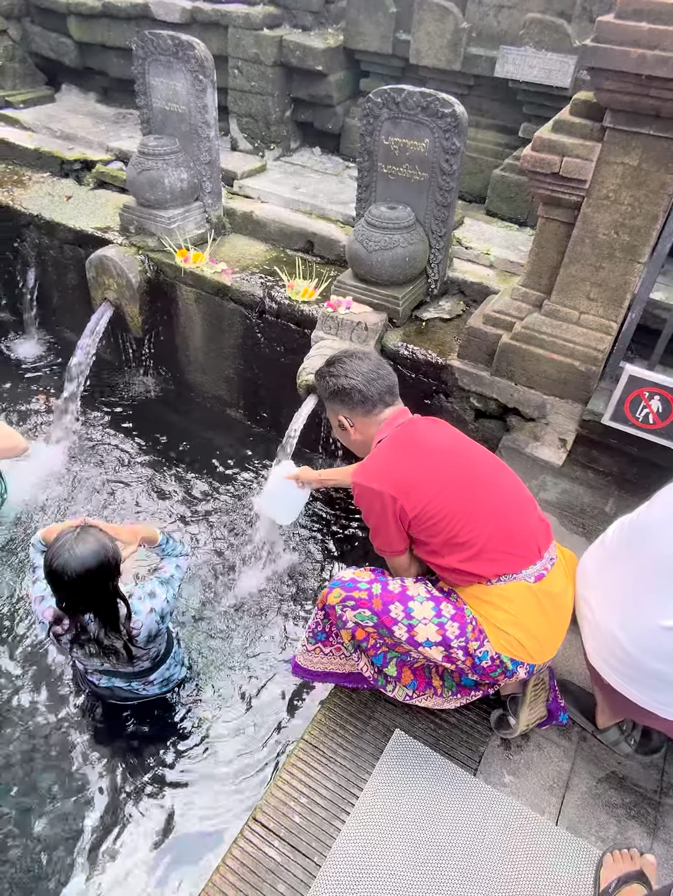
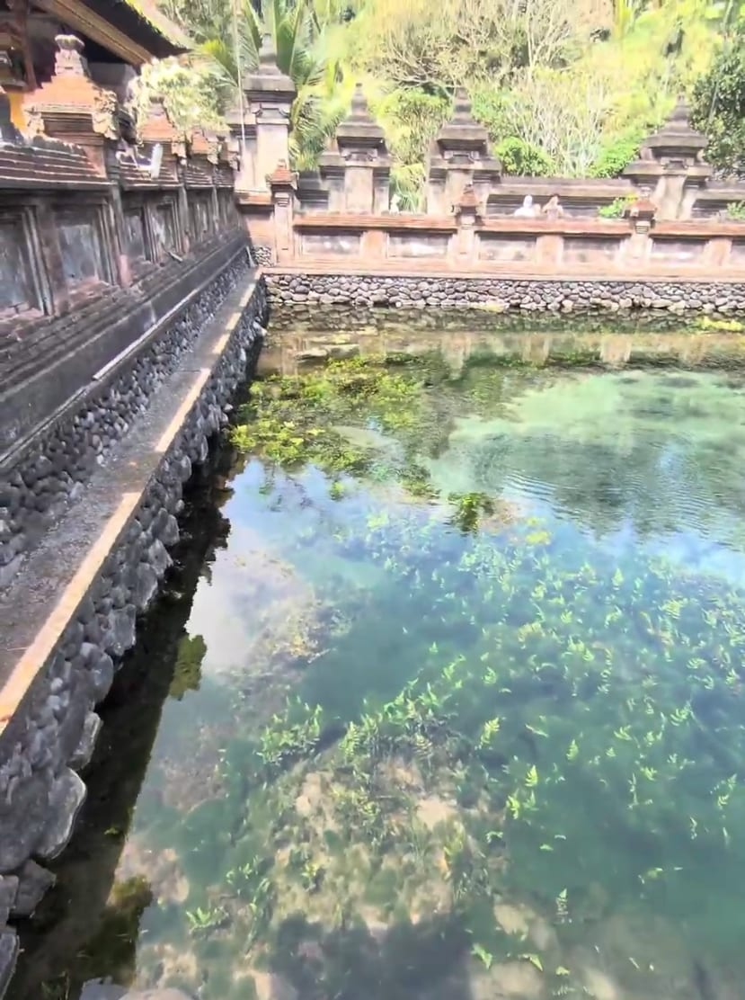
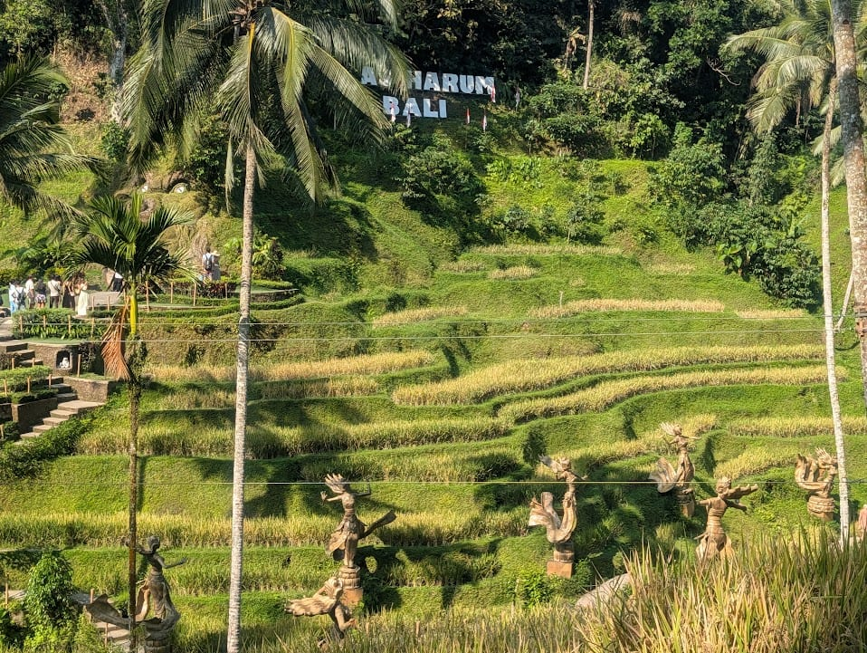

At half past eight in the morning, just as the Balinese sun was beginning to bite, our driver Hu Jianzhou was already waiting outside the hotel lobby. A fourth-generation Chinese Indonesian, he had a face steeped in Southeast Asian sunlight. His mother tongue was Indonesian, but what came out of his mouth was a sharp, sing-song Hokkien. He talked fast, every sentence ending on a slight upward lilt, with the natural gift of someone who knows how to hold an audience.

The car headed toward Tirta Empul, and the hour-long drive was perfect for small talk. Mr. Hu had been in Bali for seventeen years. Two sons: the elder at university, the younger just fifteen months old, and the household ran entirely on his wife. He had started out as a full-time guide leading big tour groups, but as costs grew harder to control and tourists ever more price-sensitive, he switched to driving for a booking platform. Our route today cost a little over 400 yuan per person; I asked how much of that reached him. "Three hundred and something," he said. Last month he had worked every single day, and on an island where a thousand yuan covers a month's expenses, life must have been reasonably comfortable.

Talk turned to the scenery along the way, and he mentioned the volcano in passing. I have always been more drawn to nature than to ticking off sights, so I asked whether we could swap the palace for the volcano. Mr. Hu thought for a moment, said yes, and proposed replacing the market with a Chinese temple near the viewpoint — an extra hundred yuan for fuel would cover it. Deal. "Just call me Ah Zhou," he said.

"There's a temple up there, one of the very few that worships a Chinese deity — Kang Cing Wie," Ah Zhou explained, turning the wheel. "She came to Bali with her father, a merchant, and later married the king. After enough centuries of worship, she became a god. My wife and I go to pray on the first and fifteenth of every lunar month, then have a buffet nearby."

We hit a stretch of rough road, and a piece of wood dangling from the rearview mirror swung wildly. I asked about it offhand, and only then did Ah Zhou tell me it was agarwood. Since childhood he had been "sensitive" beyond the ordinary, often perceiving things others could not. When the energy in the car felt wrong while driving, he would light a small piece of agarwood to settle his mind and ward off whatever was lurking.

"Back in school, a girl in my class kept getting 'possessed.' They called in every kind of master and nothing worked, until a Chinese Taoist priest burned agarwood and she finally slept in peace." That calm, bittersweet scent stayed with him for years. A few years ago he happened to smell it again, realized it was the agarwood from that day, and bought a stick to keep in the car. As for the break in the wood — his fifteen-month-old son seemed to have inherited his constitution and often cried inconsolably at night. Nothing helped, until they tried burning agarwood and the boy went quiet. So Ah Zhou snapped off half to keep at home. As he spoke, he lit the agarwood, and a faint woody scent spread through the car. It did, admittedly, gather the mind.

Chatting, we arrived at the viewpoint. Two active volcanoes and one extinct one looked indistinguishable under the cloud cover; only the ash-gray grass on the slopes hinted at anything unusual. After a brief stop we headed for the temple, to experience a day in Ah Zhou's life. He swiped through family photos on his phone and laughed that his younger son had inherited his "sensitivity," while the elder had inherited his way with girls — back in primary school, a girl had actually come to the house to ask Ah Zhou's wife whether she could date her son. He handed over the phone; the lock screen showed a handsome, dark-skinned young man. Ah Zhou was not exaggerating.

Wrapped in sarongs, we passed through the split gate into a small temple thick with incense. Ah Zhou fetched us seventeen sticks, and we prayed our way from Guan Gong and Guanyin down to the Earth God and the Tiger General — a whole pantheon sharing incense in one small courtyard. Before we lit them, he leaned in and whispered a warning: "Ask for anything you like, but never make a promise in your head — no 'if this works out, I'll do such-and-such.'" Sound advice, I thought. If some single-minded deity decided to come collect, having it follow us back to the northern hemisphere would be a nuisance.

Prayers done, we set off for Tirta Empul. Along the way, whichever household was celebrating or mourning was obvious from the clothing and the decorations at the gate. Ah Zhou said the Balinese regard cremation as a joyful passage to peace. When a poor family cannot afford it, several neighbors from the village bury the body first and set up a shared "cremation fund," adding whatever spare money comes their way. Once there is enough, they choose an auspicious day and cremate their dead together. "It's fine to be a little late. Everyone chips in, and the family gets a proper send-off."

Midway we stopped at a kopi luwak plantation. Ah Zhou led us through the grounds like a wandering herbalist, pointing at the weeds along the path as if reciting family treasures: "This leaf for high blood pressure, sugar, and cholesterol — chew it for a while and the numbers come down. That grass for stomach trouble — steep it in water, drink it twice, done." He pinched off a tender leaf, popped it into his mouth, chewed with relish, and handed me one. I put it in my mouth half-convinced; a faint, astringent bitterness spread across my tongue. Beside me Ah Zhou wore the settled expression of a man in possession of some secret Southeast Asian remedy.

At Tirta Empul, Ah Zhou pointed to the presidential palace next door: Wisma Negara, the State Guesthouse, was where Premier Zhou Enlai stayed on his visit, and the "Friendship Bridge" between the two buildings symbolizes the bond between the two countries.

At the heart of the temple, three springs bubble up pure water without pause, channeled through pipes for blessing, purification, and other purposes into the bathing pools. The pools were packed, people soaking as they waited their turn. Ah Zhou wasted no such opportunity: from somewhere he produced a plastic bucket, filled it to the brim with holy water, and stowed it in the trunk to sprinkle around his house against evil spirits.

In front of the springs, Ah Zhou told us the legend of the two sacred eels in the pool, one white and one gray. They hold an exalted place in Indonesian hearts, he said. Even the country's female president once came in person, determined to witness the miracle, with assorted masters performing rites at the water's edge — and the eels never showed. A tour group from China that he once led went further: having heard that a wish made upon seeing the two eels entwined would come true, one man insisted on being "the chosen one," canceled the rest of the itinerary, and waited four hours by the pool. Not a shadow of a fish. In more than a decade of guiding, Ah Zhou himself had glimpsed them only once, from far across the water.

Outside Tirta Empul lies a loud open-air market. Before we stepped in, Ah Zhou leaned over and passed on the secret: "Whatever you like, ignore the sticker price and counter at a third." Half-doubting, I tried my luck on a hand-painted wooden bowl. The vendor opened at 250,000 rupiah; I held firm at 100,000. A few rounds of back-and-forth later, the prophecy came true and the bowl was mine. Ah Zhou watched from a distance, smoking, with the unbothered look of a local who has seen it all.

Then the rice terraces. It was already two in the afternoon. The original plan was for Ah Zhou to rest and eat outside while we wandered, but as he walked us in and pointed out a restaurant where we could get lunch, we invited him to join us — our treat. He declined several times and then accepted with pleasure. He ordered the 200,000-rupiah grilled pork ribs, which he highly recommended, so we ordered the same plus an oxtail soup. Ah Zhou never said thank you. He smoked a cigarette and worked through his ribs unhurriedly. The ribs and soup really were excellent: 700,000 rupiah altogether, under fifty dollars, for a meal like that inside a major tourist site — a far cry from American prices. After lunch we parted ways, took a short walk, and met him again outside.

While we waited for the shuttle, a stocky female guide strode past us to the front with her big group. Ah Zhou called across the crowd, "Cutting in line this openly?" She turned and laughed: "We're together!" Ah Zhou waved her off: "Wouldn't dare — your husband would beat me up." Seeing our surprise at his easy familiarity, he grinned and explained she was a high-school classmate. "She was the boss back then — the kind who could lead a whole gang of girls in headscarves out to the nightclub."

On the way back we passed Ubud Palace at rush hour, and traffic on the narrow streets ground to a complete halt.

Red brake lights stretched into a single line. Ah Zhou pulled the handbrake, pointed at the motorbikes weaving past the window, and let the talk drift. Balinese folk, he said, were far gentler than the Javanese. In a big city like Jakarta, street robbery was so rampant it had become urban legend: "If you're wearing a fake gold chain and get robbed, and the robber finds out it's fake, he gives you two choices — swallow the fake gold, or take two holes."

"Two holes?" We froze.

"Yeah, two stabs." Ah Zhou shrugged and changed course. "But Bali is completely different."

Not long after he had moved to Bali, he got lost in a neighborhood at night and walked straight into a group of local men sitting around drinking. His heart sank — the shadow of the anti-Chinese violence of earlier years still hung over him — and he assumed a beating and a robbery were coming, maybe worse. Instead one of the men walked over and clapped him on the shoulder: "Hey man, you've been circling for a while. Need help?"

"I told him I couldn't find my way. He gestured for ages and still couldn't explain it, so he just got on his motorbike and drove me home." Ah Zhou smiled. "On the way he found out I could fix computers and got excited — 'Perfect, mine's broken, take a look.' That was the first Indonesian friend I ever made. Later he got a Japanese girlfriend and went to work in Japan. We wrote for a while, then slowly lost touch."

By the time it was fully dark, the car finally crawled out of the worst of the jam. Asked about his early working life, Ah Zhou told us about his stint as an interpreter at a large factory — a job where you take heat from both sides. The Indonesian managers had short tempers, and the Chinese foremen represented the workers' demands; at the most absurd moment he was juggling five walkie-talkies alone, relaying between all parties. "When the boss swears, you can't translate it word for word. When the Indonesian workers grumble about slowing down, you have to soften that too. Everything gets filtered through your head before it goes across, and all the swearing just rots in your stomach — it starts to feel like they're cursing me." He did it for about a year and earned the trust of workers on both sides; more than one conflict was defused only because he was there. "Because I never listen to just one side — I always hear both out before I translate," he said proudly. He was so good at it that after he left, the team lead came looking for him many times, hoping he would come back.

Just before nine, the car finally pulled up at the hotel. On top of the hundred yuan for fuel we had agreed on, I handed over 400,000 rupiah in total, as compensation for the long crawl through traffic. Ah Zhou took the money and, once again, offered none of the scripted thanks. He just smiled, shook our hands, and wished us good night — brisk and natural.

The car turned the corner, and its red taillights quickly dissolved into the humid Balinese night.

I thought back to the morning, to how smoothly he had gone along with the detour to the volcano, and suddenly I wasn't sure — was it an old hand's soft, imperceptible upsell, or just a whim? Then again, it hardly seemed to matter. Compared with the formulaic stone carvings in the palace, Ah Zhou's half-true tales of ghosts and gods, his wisdom for surviving in the cracks, and that perfectly calibrated street-smart shrewdness felt far more like Bali itself than any sight we could have seen.
